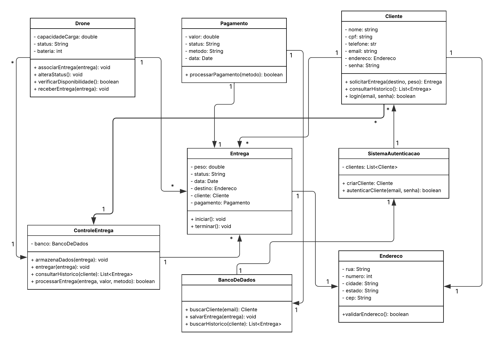
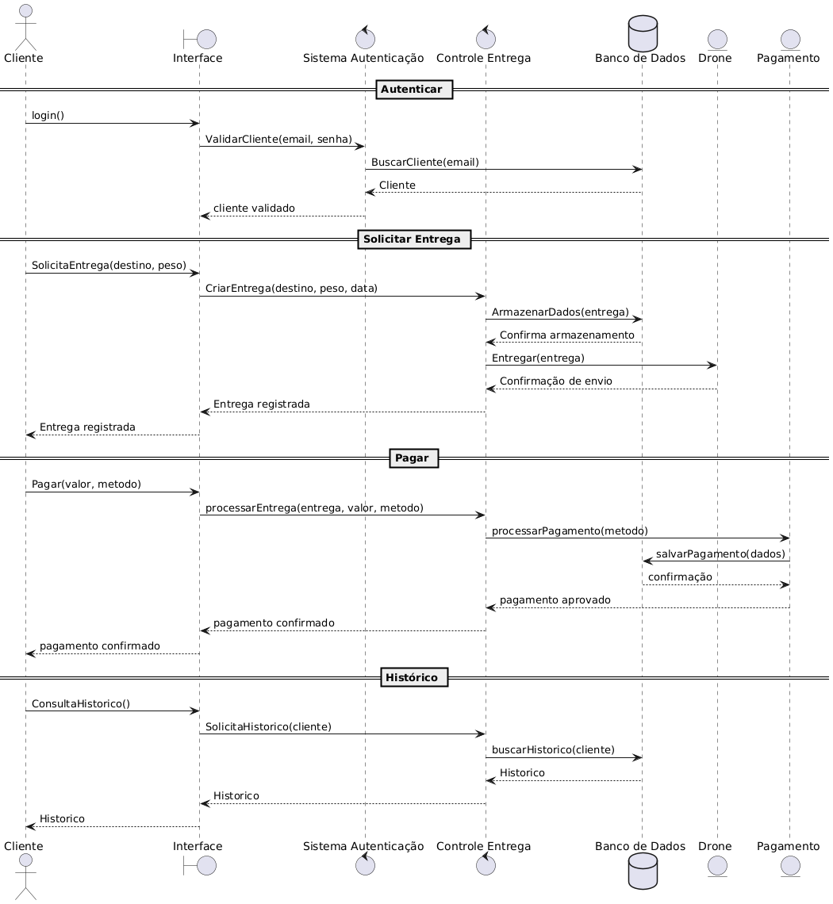
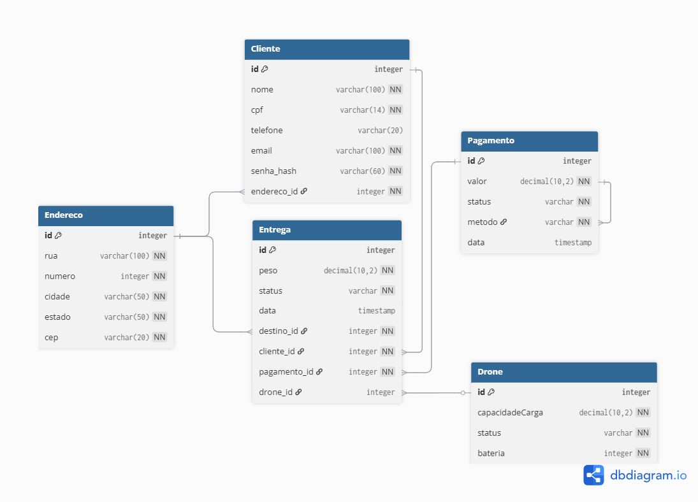

<h2><a href= "https://www.mackenzie.br">Universidade Presbiteriana Mackenzie</a></h2>
<h3><a href= "https://www.mackenzie.br/graduacao/sao-paulo-higienopolis/sistemas-de-informacao">Ciência da Computação</a></h3>

MoranaAir

*Conteúdo*

- [Autores](#Autores)
- [Descrição do Projeto](#Descrição-do-Projeto)
- [Diagrama de Classes](#Diagrama-de-Classes)
- [Diagrama de Senquencia](#Diagrama-de-Sequência)
- [Integração de Modelos](#Integração-de-Modelos)
- [Diagrama de Projeto](#Diagrama-de-Projeto)
- [Integração Sequência + Colaboração](#Integração-Sequência-+-Colaboração)
- [Diagrama de Estados](#Diagrama-de-Estados)
- [Referências](#Referências)

# Autores

* Ana Julia Yaguti Matilha
* Guilherme Clauz Morlina da Silva

# Descrição do Projeto

Sistema acadêmico de entregas com drones, desenvolvido em Java com UML e boas práticas de segurança. Permite cadastro de clientes e drones, solicitação de entregas, atribuição automática do drone adequado e histórico de entregas, com validação de dados e prevenção de falhas.

# Diagrama de Classes

Diagrama de relacionamento entre classes para os seus atributos e operações

# Diagrama de Sequência

Diagrama de ordem e interação dos objetos

# Integração de Modelos

# Diagrama de Projeto

# Integração Sequência + Colaboração

# Referências

# Diagrama de Estados

&lt; Lista de referências&gt;